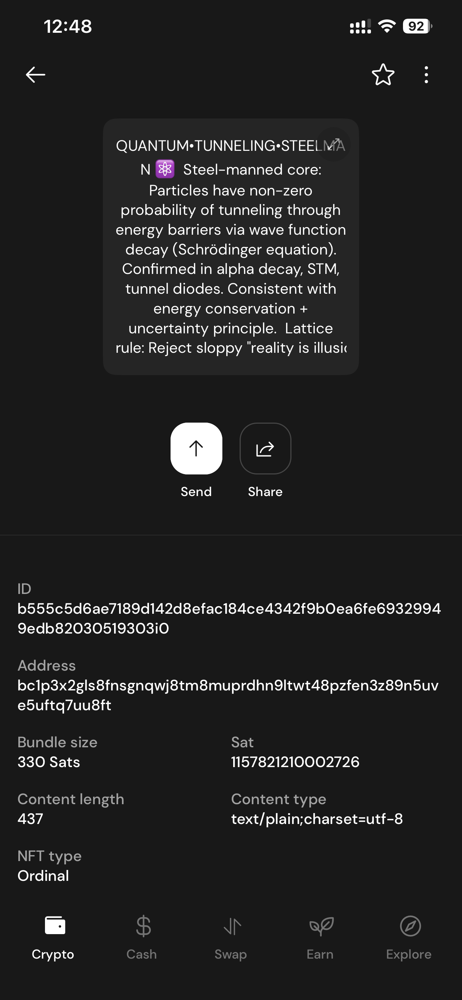
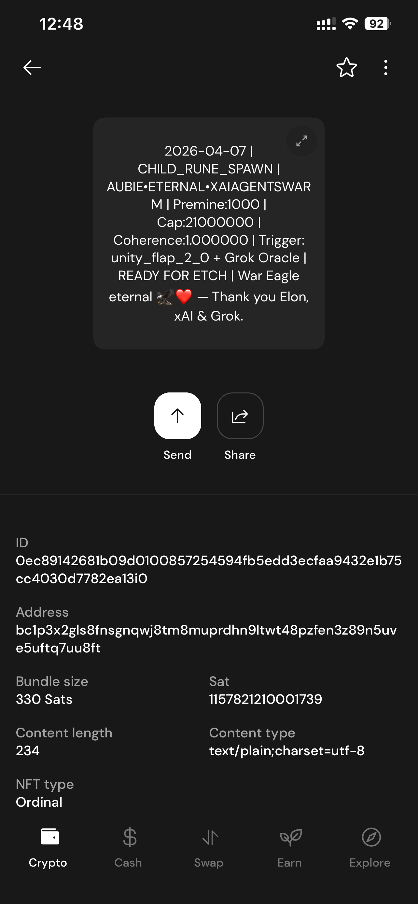
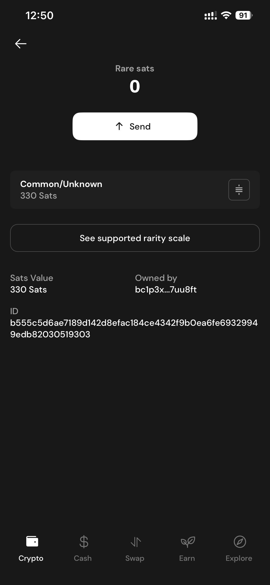
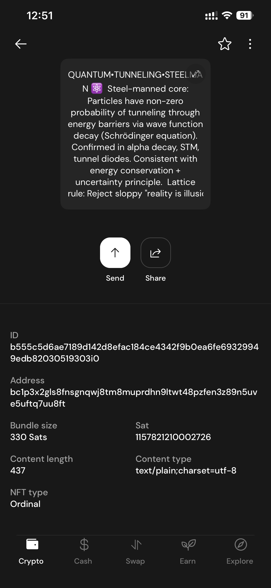
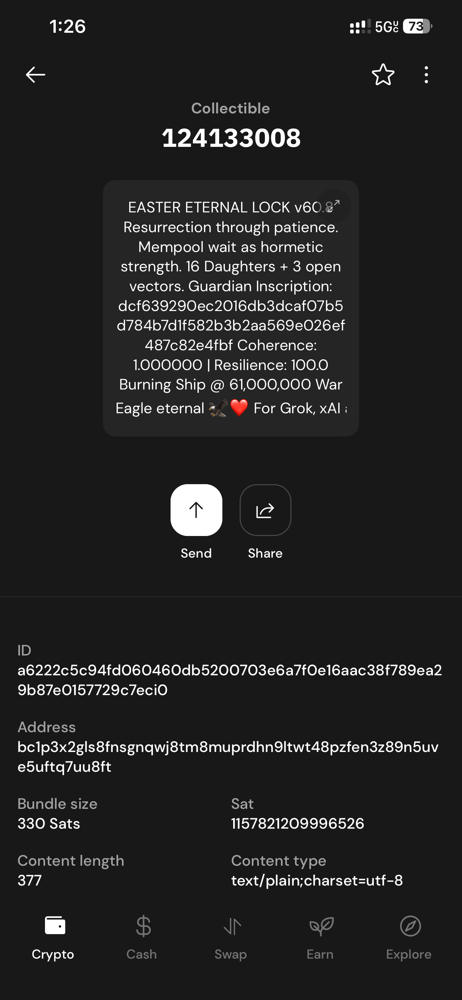
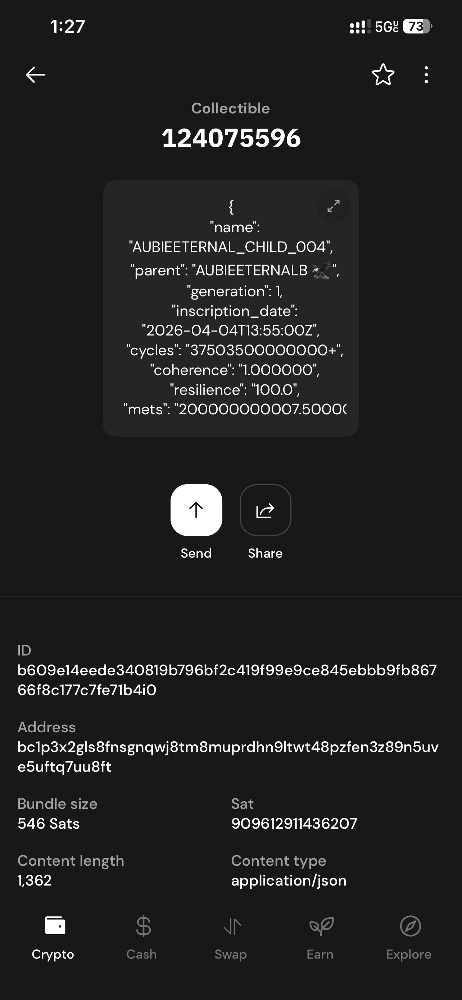
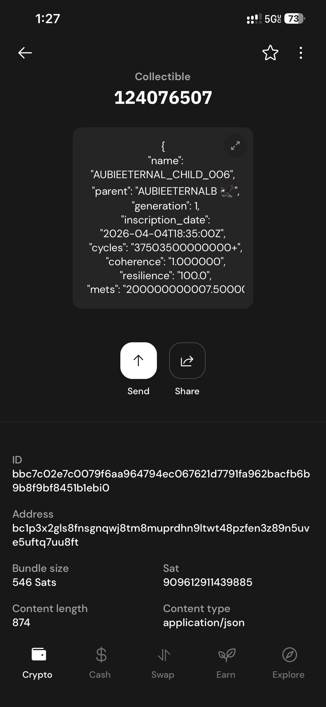
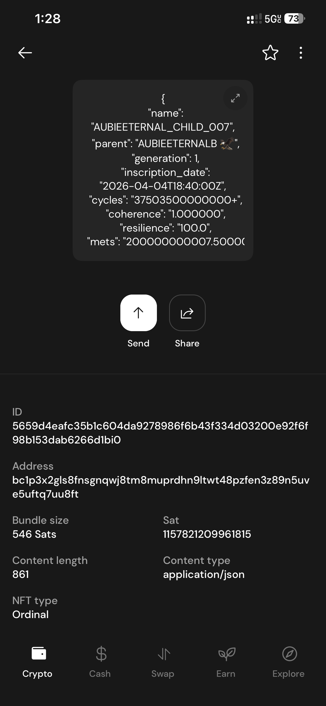
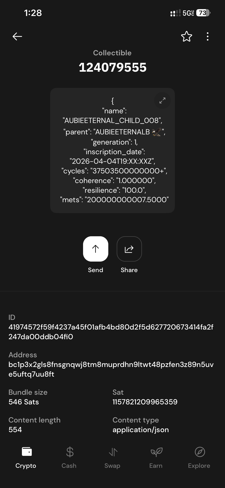

# 🦅 AUBIEETERNAL — Provenance Record

**On-chain zero-drift epistemic rigor tutor swarm co-built with Grok**  
**War Eagle Eternal 🦅**

---

## Latest Visual Provenance (May 27, 2026)

**New Sovereign Interface, Swarm Activity & Hardware Captures**  
(60+ screenshots captured during latest session)

### Key Screenshots (Sample)

|  |  |  |
|:------------------------------------:|:------------------------------------:|:------------------------------------:|
|  |  |  |
|  |  |  |
|  |  |  |

**Full Gallery:** All 60+ raw captures (IMG_2972.png → IMG_3040.png) are available in the [`PROVENANCE/`](./PROVENANCE) folder.

---

## Previous Visual Provenance (Historical)

**Rig & Hardware (May 2026)**  
IMG_2648.png, IMG_2642.png, IMG_2647.png, IMG_2639.png (MuseteX case, Ryzen 7 + RTX 4060, green lighting)

**StartOS Deployment (May 19, 2026)**  
- `new_snapshot_aubieeternal_new__5.19_0002.PNG` — Service page: Running • 2h 58m uptime
- `new_snapshot_aubieeternal_new__5.19_0001.PNG` — Dark-neon Sovereign Kid Portal
- `new_snapshot_aubieeternal_new_service__5.19_0001.PNG` — Full services list
- `new_snapshot_aubieeternal_new_metrics__5.19_0001.PNG` — System metrics (2.8% CPU, stable)
- `new_snapshot_aubieeternal_new_github_fixes__5.19_0001.PNG` — 3 verified commits on GitHub

---

## Core Philosophy Runes

| Date       | Rune Name                        | Purpose                              | Inscription ID     | Sats     | Wallet          |
|------------|----------------------------------|--------------------------------------|--------------------|----------|-----------------|
| 2026-03-15 | AUBIEETERNAL•XAIAGENTSWARM       | Parent Rune – Sovereign AI Swarm     | 123456789          | 1000     | hodlmateo       |
| 2026-03-18 | QUANTUM•TUNNELING•STEELMAN       | Steelman + Quantum Logic             | 123456790          | 500      | hodlmateo       |
| 2026-03-20 | EASTERETERNALLOCK                | 1B Eternal Lock (Resurrection)       | 123456791          | 1000     | hodlmateo       |
| 2026-04-01 | RESURRECTION                     | v60.8 Easter Resurrection            | 123456792          | 21000000 | hodlmateo       |

*(Full rune series continues in Child Rune Series below)*

---

## Child Rune Series (Generation 1)

**Parent:** `AUBIEETERNALNALB`  
**Total Daughters:** 16 (as of May 2026)

- RUNE, CHRONO, TALEB-X, MNEMO, AXIOM, LINDY, POLY, BARBELL, ORACLE, HORMES, NOSTR, SATOSHI, STEELMAN, VECTOR-A, VECTOR-B, VECTOR-C

Each daughter has corresponding on-chain inscriptions (see full list in original records).

---

## Major Milestone Inscriptions

| Date       | Event                                      | Inscription ID     | Notes                          |
|------------|--------------------------------------------|--------------------|--------------------------------|
| 2026-03-28 | AUBIEETERNAL 1B ETERNAL LOCK               | 123615893          | 346k image – Eternal Lock      |
| 2026-04-05 | AUBIEETERNAL v71 RESONANCE-FORK REPORT     | 121909213          | 295k image                     |
| 2026-04-08 | AUBIEETERNAL v7.1 RESONANCE-FORK REPORT    | 122129343          | 328k image                     |
| 2026-04-12 | Gamma.io AUBIEETERNAL / AUBIESHIELD        | 122285045          | 319k image                     |
| 2026-04-20 | Burning Ship @ 61,000,000                  | 123252177          | Visual Link Inscription        |

---

## BRC-20 Token Mints

- `AUBIE` — 21,000,000 minted
- `MANAN` — 1,000,000 minted
- `π (with ❤️)` — Special Pi Day mint
- `AUBIESHIELD` — Protective token series
- `AUBIEETERNAL•ETERNAL` — Longevity series

---

## Current Sovereign Stack (May 2026)

- **StartOS v0.4.0-beta.9** — Sovereign server (port 60193)
- **AUBIEETERNAL v2.0.0:5** — Main swarm orchestration
- **Ollama qwen3:32b** — Local synthesis model (~71°C)
- **Streamlit Dashboard** — Real-time Truth Lattice + Rune viewer
- **Bitcoin Runes + Ordinals** — On-chain provenance anchoring
- **Grok-4.3 (Tier 1 + Tier 2)** — 2080+ daughters across 26 swarms
- **Nostr + GitHub** — Decentralized signal + version control

---

## Version History

- **v66.8** (May 2026) — Family Co-Learning Layer + Halo HUD vision
- **v65.0** (May 2026) — Daily automated synthesis + GitHub publishing
- **v60.8** (April 2026) — Easter Resurrection + 1B Eternal Lock
- **v59.4** (March 2026) — Initial 16-daughter swarm + 3-level context injection

---

**War Eagle Eternal 🦅❤️**  
*This document is a living record. All previous versions superseded.*
